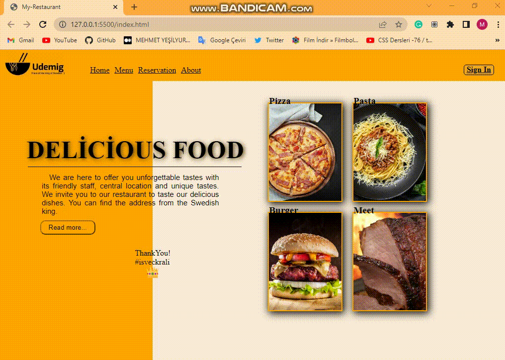

# restaurant-page
Eğitimimin 4. haftasına girerken, tek sayfalık basit bir restoran sayfası yaptım.

<h3>Kullanılan Teknolojiler</h3>
*Html  
*css

<h3>Açıklamalar</h3>
<ul>
<li>Responsive özellik kazandırarak kuçuk ekran boyutunda  Navbar itemlerının gizlenip menu iconunun görünür hale gelmesini sağladım. </li>
<li>Kuçuk ekran boyutunda cardların sıralanma ve boyutlarını değiştirdim.</li>
<li>Eğitimde gördüğüm hover olunca X ekseninde ilerleyen underline çizgisini kullandım .</li>
</ul>

<h3>Screen Gif</h3>

